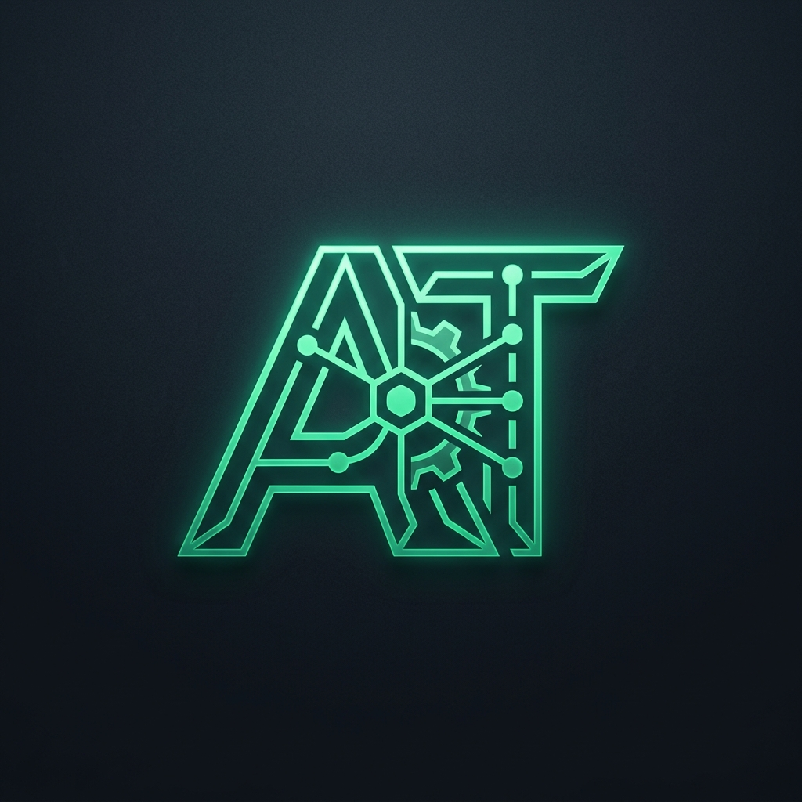
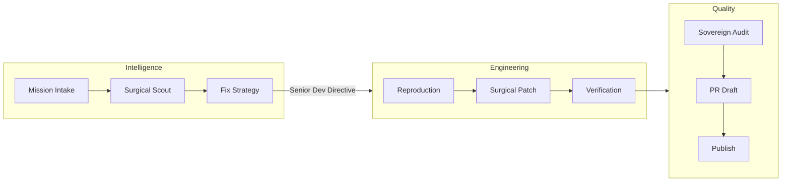
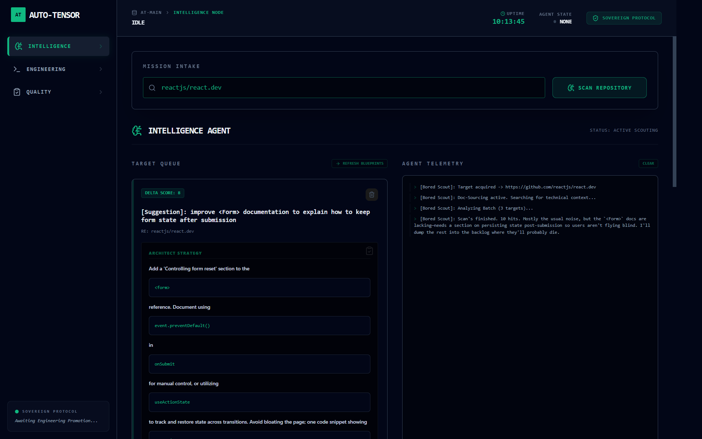

<div align="center">
  


# ⚡ Auto-Tensor v2.1

### The Network Operations Center

**Autonomous SRE Dispatcher · Sovereign Workflow Orchestrator · Bittensor Miner**

[](https://www.python.org/)
[](https://learn.microsoft.com/en-us/windows/wsl/)
[]()
[](LICENSE)
[]()

_A surgical, multi-agent system that scouts high-value GitHub issues, proposes "Architect Strategies," and executes precision fixes via the Sovereign Hand-off — governed by the Triptych NOC._

</div>

---

## 🧠 What Is Auto-Tensor?

**Auto-Tensor** is an autonomous SRE operator designed for high-velocity maintenance of Web3 infrastructure. It has evolved into a **Directed Execution** engine, replacing generic AI exploration with a strict **Architect -> Contractor** model.

### The Triptych NOC Architecture

The system is managed via a three-node Network Operations Center:

1.  **Intelligence Node (Scout)**: Targeted repository scanning and "Fix Blueprint" generation.
2.  **Engineering Node (Coder)**: Precision reproduction and patch execution driven by Senior Dev Directives.
3.  **Quality Node (Reviewer)**: The Sovereign Gate — Audit, Draft, and Publish stages for production-grade hand-overs.

---

## 🏗️ The Sovereign Hand-off Workflow



---

## 📸 Screenshots

### Triptych NOC Console (v2.1)



_The Industrial Sovereign aesthetic: Real-time telemetry, mission intake dispatcher, and the Sovereign Gate workflow._

---

## 🚀 Technical Stack

- **Core**: Python 3.12 (WSL 2 Mandate)
- **Intelligence**: Gemini 3 Flash (v1beta) — High-fidelity strategy generation.
- **Orchestration**: FastAPI Bridge with isolated agent telemetry logs.
- **Frontend**: React + Vite + Tailwind — Multi-node agent management.
- **Integrations**: GitHub API v3, Docker Desktop (Reproduction Environment).

---

## 🔧 Operational Modes

### 1. Intelligence — Mission Intake

The **Mission Intake Bar** allows operators to paste a repository URL. The Scout eagerly scans for the top 5 issues and generates a **Fix Strategy** (Architect Blueprint) for each.

- **Targeting**: Delta Scoring based on TypeScript complexity (`any` usage) and SRE impact.

### 2. Engineering — Directed Execution

Upon promotion, the **Senior Dev Directive** logic kicks in. The Architect's strategy is injected into the Coder's system prompt, enforcing 100% precision and eliminating unrelated refactoring.

### 3. Quality — The Sovereign Gate

PRs are tiered through three stages:

- **Audit**: Automated SRE verification scan.
- **Draft**: Persona-driven PR description generation (using the "Bored Contributor" style).
- **Publish**: Final dispatch to the upstream repository.

---

## 🛡️ The Governor

`core/health_check.py` maintains continuous monitoring of the GitHub API quota.

- **Heartbeat Protection**: If quota drops below 15% (750 remaining), the NOC enters **Safe Mode**, halting all Scout/Coder background processes to protect the Miner's priority.

---

## 🚀 Quick Start

### 1. Clone & Enter WSL

```bash
git clone git@github.com:Tmalone1250/auto-tensor.git
cd auto-tensor
```

### 2. Launch the Bridge

```bash
./start_command_center.sh
```

_This initializes the FastAPI backend and the Vite dashboard simultaneously._

### 3. Dispatch a Mission

Paste a repository URL into the **Intelligence** node, wait for the **Node Sync** to generate strategies, and click **Promote** to trigger the Engineering agent.

---

## 📋 Operational Constraints

| Rule                    | Detail                                                                  |
| ----------------------- | ----------------------------------------------------------------------- |
| **Architect Directive** | The Coder MUST follow the fix strategy. No unrelated exploration.       |
| **Surgical Density**    | PRs must change ≤ 20 lines. No fluff.                                   |
| **WSL Mandate**         | All shell execution routes through `wsl bash`. No PowerShell.           |
| **Bored Persona**       | All external communication follows the "Bored Contributor" CASUAL tone. |

---

## 📄 License

MIT © [Trevor Malon](https://github.com/Tmalone1250)

<div align="center">

_Built for the Bittensor network — where code quality is proof of work._

</div>
